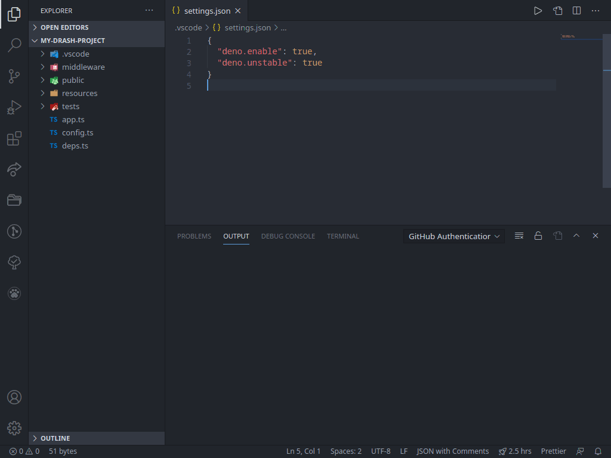

# Custom Format

Run custom CLI commands for formatting files in VSCode.

How many times have you not been able to find a VSCode formatter for your particular purpose when there was already a CLI to do the job?  And how much easier is it to throw together a CLI command to format your code that it is to build an extension to suit your needs?

Because you are reading this, those questions can be favorably answered.  Introducing _Custom Format_.  Just add your CLI commands to the `custom-format.formatters` [configuration](#configuration) and you're set.



## Configuration

Populate the `custom-format.formatters` setting.

```jsonc
// global settings.json or .vscode/settings.json
{
	// ...

	// Create our custom formatters
	"custom-format.formatters": [
		{
			// Whatever language id you need to format
			"language": "javascript",
			// The command that will be run to format files with the language id specified above
			"command": "node format.js $FILE" // $FILE is replaced with the path of the file to be formatted
		},
		{
			"language": "typescript",
			"command": "node format-ts.js"
		}
	],

	// (optional) Set it as the default formatter for the languages we have configured formatters for
	"[javascript]": {
		"editor.defaultFormatter": "vehmloewff.custom-format"
	},
	"[typescript]": {
		"editor.defaultFormatter": "vehmloewff.custom-format"
	}
}
```

### Running commands

All specified commands are expected to read in unformatted code on their `stdin` and print the formatted code to their `stdout`.

In all cases, if any text is printed to `stderr`, the error will be relayed to the "Custom Format" output panel.

If text is printed to `stdout`, error or no error, the file will be overwritten with the printed text.

If there is no content written to `stdout`, error or no error, the formatting of the file will be skipped.

If the command exits with a non-zero code, the formatting of the file will be skipped.

Before the command is executed, all instances of `$FILE` therein are replaced with the absolute path of the file that is being formatted.

## Release Notes

See the [changelog](/CHANGELOG.md).

## License

[MIT](/LICENSE)
